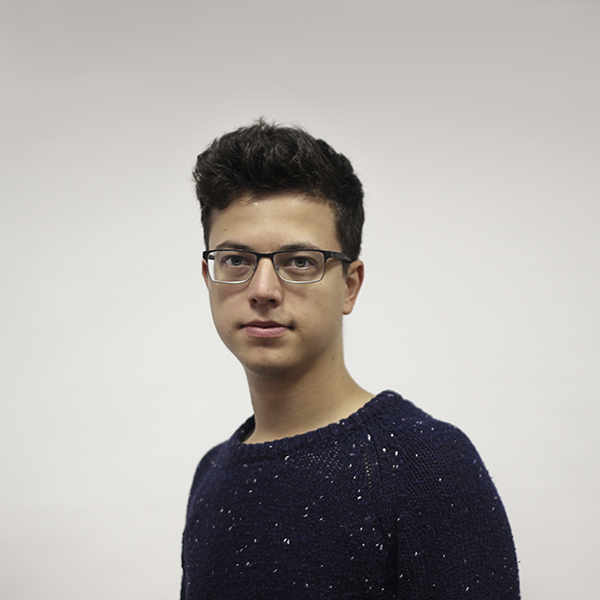
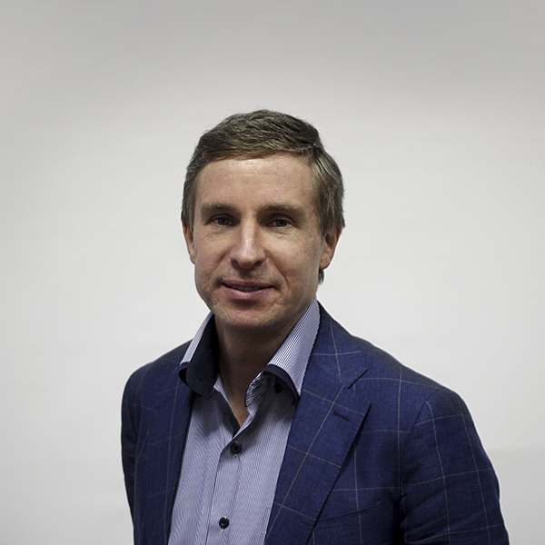
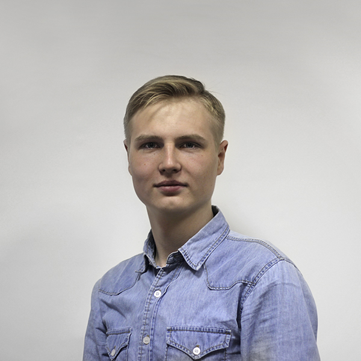
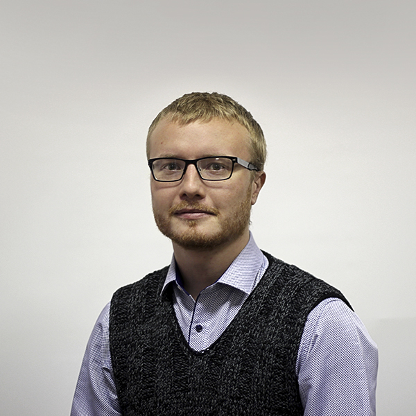

.. |div_cards| raw:: html

   

.. |div_card_item| raw:: html

   

.. |div_item_about| raw:: html

   

.. |div_item_header| raw:: html

   

.. |div_item_desc| raw:: html

   

.. |/div| raw:: html

   

Команда разработчиков
=====================

Библиотека OpenAV разработана и поддерживается исследовательской группой из лаборатории речевых и многомодальных интерфейсов (ЛРМИ) Санкт-Петербургского Федерального исследовательского центра Российской академии наук (СПб ФИЦ РАН):

|div_cards|
|div_card_item|
|Иванько_Денис|
|div_item_about|
|div_item_header|
Иванько Денис
|/div|
|div_item_desc|
Руководитель проекта. Старший научный сотрудник Федерального государственного бюджетного учреждения науки «Санкт-Петербургский Федеральный исследовательский центр Российской академии наук» (СПб ФИЦ РАН)
|/div|
|/div|
|/div|
|div_card_item|
|Рюмин_Дмитрий|
|div_item_about|
|div_item_header|
Рюмин Дмитрий
|/div|
|div_item_desc|
Главный разработчик программного обеспечения. Старший научный сотрудник Федерального государственного бюджетного учреждения науки «Санкт-Петербургский Федеральный исследовательский центр Российской академии наук» (СПб ФИЦ РАН)
|/div|
|/div|
|/div|
|div_card_item|
|Маркитантов_Максим|
|div_item_about|
|div_item_header|
Маркитантов Максим
|/div|
|div_item_desc|
Программист, разработчик программного обеспечения. Младший научный сотрудник Федерального государственного бюджетного учреждения науки «Санкт-Петербургский Федеральный исследовательский центр Российской академии наук» (СПб ФИЦ РАН)
|/div|
|/div|
|/div|
|div_card_item|
|Шилов_Николай|
|div_item_about|
|div_item_header|
Шилов Николай
|/div|
|div_item_desc|
Разработчик алгоритмов и методов обработки видеоданных. Старший научный сотрудник Федерального государственного бюджетного учреждения науки «Санкт-Петербургский Федеральный исследовательский центр Российской академии наук» (СПб ФИЦ РАН)
|/div|
|/div|
|/div|
|div_card_item|
|Карпов_Алексей|
|div_item_about|
|div_item_header|
Карпов Алексей
|/div|
|div_item_desc|
Разработчик алгоритмов и методов обработки акустических данных, а также методов объединения аудиовизуальных данных. Главный научный сотрудник Федерального государственного бюджетного учреждения науки «Санкт-Петербургский Федеральный исследовательский центр Российской академии наук» (СПб ФИЦ РАН)
|/div|
|/div|
|/div|
|/div|
