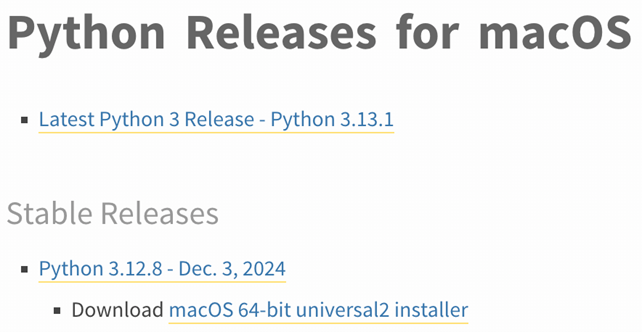
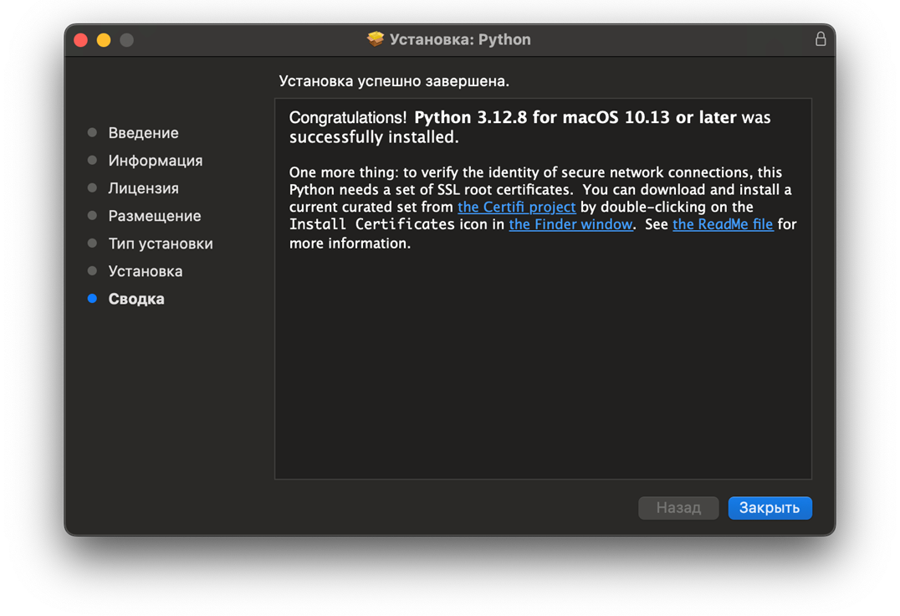
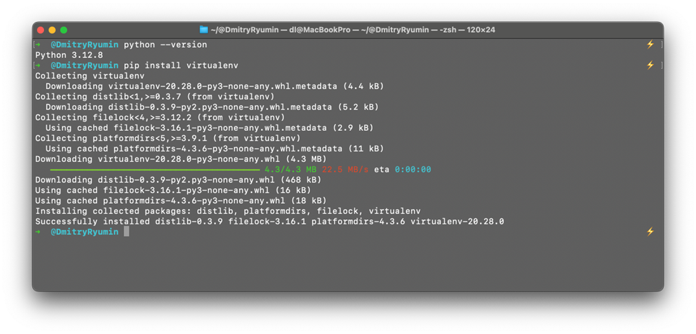
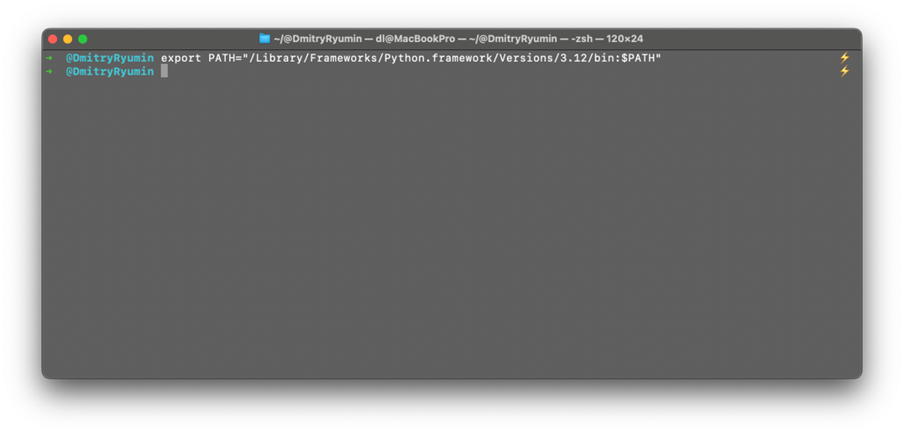
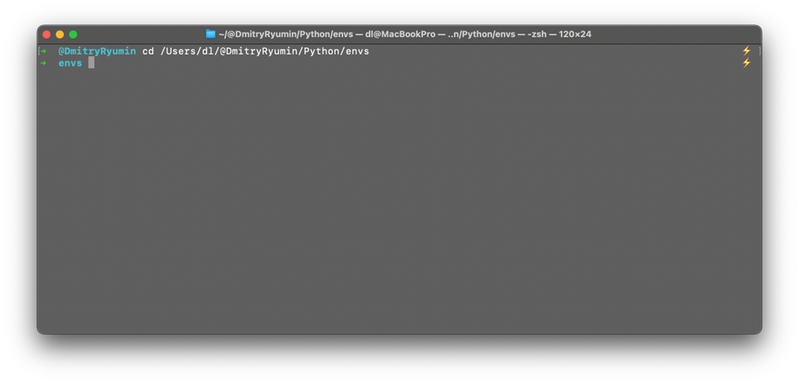
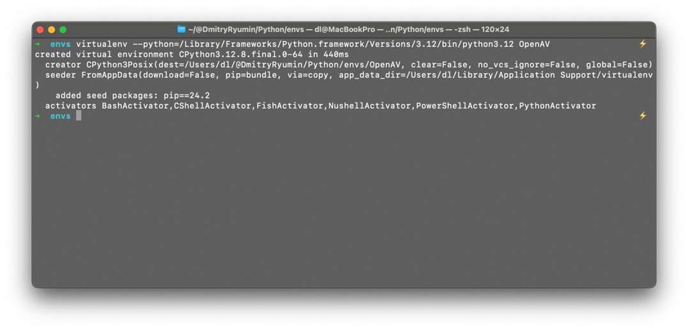
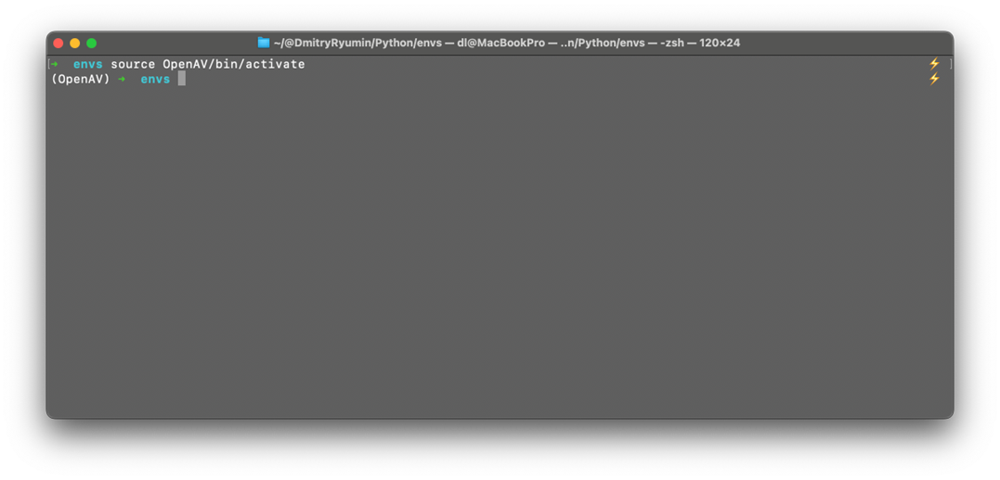
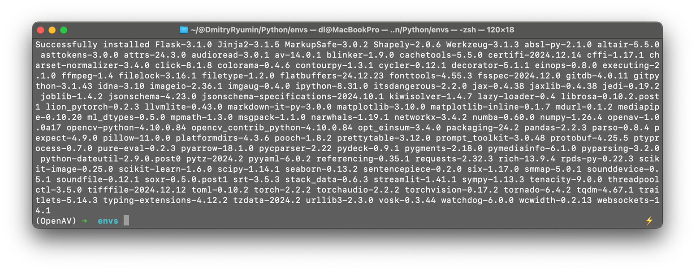

.. include:: ../../reuse_content/general.rst

.. |a_download_mac| raw:: html

    <a href="https://www.python.org/downloads/macos/" target="_blank">

Установка и обновление на операционных системах MacOS/Linux
===========================================================

Подготовка рабочего пространства
~~~~~~~~~~~~~~~~~~~~~~~~~~~~~~~~

1. Перейти на сайт и |a_download_mac| скачать необходимый дистрибутив |/a| (например Python 3.12.8)

        |br|

2. Установить Python

        |br|

3. Установить библиотеку virtualenv для создания изолированных сред Python:

.. code-block:: sh

   pip install virtualenv

        |br|

4. Добавить путь к вашей версии Python 3.10 и выше в PATH:

.. code-block:: sh

   export PATH="ПУТЬ_К_PYTHON:$PATH"

        |br|

Создание изолированной среды OpenAV
~~~~~~~~~~~~~~~~~~~~~~~~~~~~~~~~~~~

1. Создать директорию envs и перейти в нее:

.. code-block:: sh

   cd ПУТЬ_К_ДИРЕКТОРИИ

        |br|

2. Разместить новую виртуальную среду OpenAV в указанной директории с указанной версией Python:

.. code-block:: sh

   virtualenv --python=ПУТЬ_К_PYTHON OpenAV

        |br|

3. Активировать созданную виртуальную среду OpenAV в директории:

.. code-block:: sh

   source OpenAV/bin/activate

        |br|

Работа с библиотекой OpenAV
~~~~~~~~~~~~~~~~~~~~~~~~~~~

Установить библиотеку OpenAV:

.. code-block:: sh

   pip install openav

        |br|
