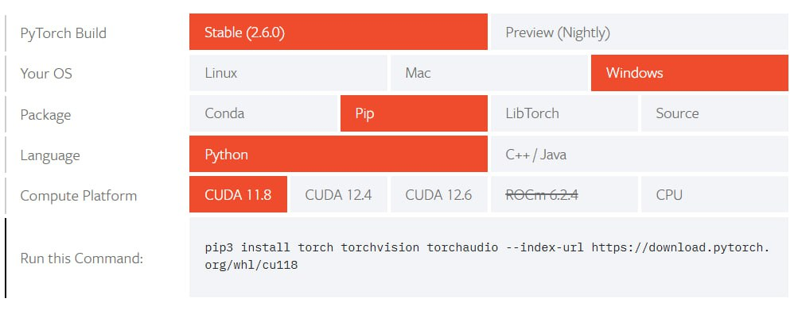
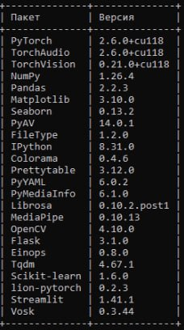

.. include:: ../../reuse_content/general.rst

.. |a_download| raw:: html

    <a href="https://pytorch.org/get-started/locally/" target="_blank">

Использование GPU при работе с библиотекой
==========================================

Для того чтобы использовать видеоадаптер (GPU) для работы с библиотекой (по умолчанию используется CPU) неоходимо выполнить следующие шаги:

1. Перейти на |a_download| сайт и выбрать необходимую версию PyTorch с поддержкой GPU для CUDA, которая установлена у вас в системе.

        |br|

Либо установить версию с помощью прямой команды (актуальная версия PyTorch с поддержкой CUDA 11.8):

.. code-block:: sh

   pip3 install torch torchvision torchaudio --index-url https://download.pytorch.org/whl/cu118

2. Убедитесь, что библиотека PyTorch с поддержкой GPU установилась корректно (все пакеты, относящиеся к torch должны иметь в версиях подпись ``+cu118`` или версию, которую вы выбрали):

.. code-block:: sh

   pip list

        |br|

3. В случае, если пакеты установились некорректно, либо они уже были установлены, но без поддержки GPU, то необходимо удалить зависимости PyTorch, а затем установить их как указано в шаге №1:

.. code-block:: sh

   pip uninstall pytorch, torchvision и torchaudio
