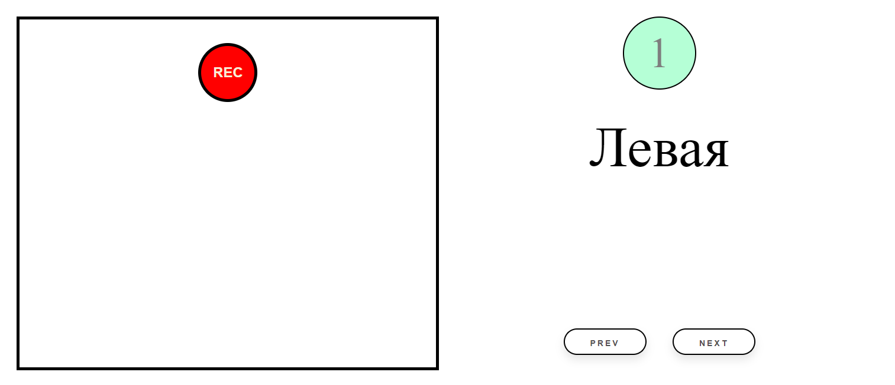
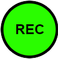

.. |b| raw:: html

   <b>

.. |/b| raw:: html

   </b>

Модуль записи речевых аудиовизуальных данных
============================================

Модуль предназначен для записи аудиовизуальных данных с последующей сортировкой по заданному словарю.

Интерфейс модуля для состоит из двух частей:

* В левой части представлено изображение, получаемое с подключенной камеры и кнопка начать запись (Rec)
* В правой части располагается блок управление словарем. В этом блоке отображаются следующие элементы:

    - Цифра в круге означает порядковый номер фразы в словаре
    - Фраза из словаря
    - Кнопки переключения элементов словаря |b| prev |/b| и |b| next |/b|, после нажатия на которые отображают предыдущую или следующую фразу соответственно

        Интерфейс модуля для записи данных

Нажатие на кнопку записи (Rec) начинает процесс записи данных После нажатия на кнопку, она изменяет свой цвет, что означает об успешном запуске записи:

        Активная кнопка записи

Повторное нажатие на кнопку записи завершает процесс. Записанный файл сохраняется по пути, указанному в конфигурационном файле. Изменить словарь словарь также можно в конфигурационном файле.
