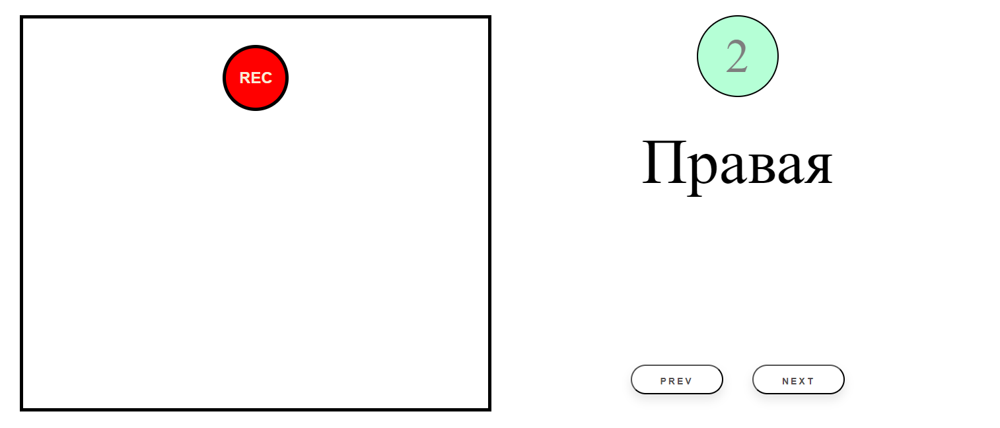

.. |b| raw:: html

   <b>

.. |/b| raw:: html

   </b>

Модуль записи речевых аудиовизуальных данных
============================================

Модуль предназначен для записи аудиовизуальных данных с последующей сортировкой по заданному словарю.

Команда для запуска модуля записи данных:

.. code-block:: sh

   python ./openav/api/recorder_app.py --config <путь_к_вашему_конфигурационному_файлу>.yaml

После выполнения команды запускается локальный сервер, на котором развертывается приложение для записи данных. Для того чтобы открыть использовать графический интерфейс модуля перейдите по адресу в браузере ``http://127.0.0.1:5000``.

Конфигурационный файл
~~~~~~~~~~~~~~~~~~~~~

В конфигурационном файле определены следующие функции, с помощью которых выполняется поиск доступных устройств и определение их технических характеристик для записи аудиовизуальных данных.

Функция ``find_my_devices (camera = True, micro = True)`` определяет и возвращает название устройств, которые подключены в системе. Передаваемые параметры ``camera`` и ``micro`` по умолчанию имеют значение ``True``. Если вам не требуется использование камеры или микрофона, то необходимо передать значение ``False``.
|b| Пример использования данной функции. |/b|
Переменным ``video`` и ``audio`` присваиваются значения, являющиеся результатом выполнения функции.

.. code-block:: sh

   video, audio = find_my_devices(True, True)

Значения, возвращаемые из функции ``find_my_devices()`` необходимы для определения параметров изображения и звука, которые поддерживает найденное в системе устройство.

Функция ``get_available_parameters (device)`` принимает название устройства ``<str> device``  и возвращает список параметров, которые поддерживает указанное устройство. В случае, если передается название вебкамеры, то возвращаемый список будет содержать все доступные параметры разрешения изображения и максимальное количество кадров, соответствующее этому разрешению.

|b| Пример использования данной функции. |/b|  Переменной ``available_camera_params`` присваивается список доступных параметров.

.. code-block:: sh

   available_camera_params = get_available_parameters (video)

Функция ``get_camera_params (dict, prefer = 'max')`` возвращает выбранные параметры из полного списка доступных параметров вебкамеры. Обязательным принимаемым на вход аргументом является список ``dict``, который был получен с помощью предыдущей функции. Аргумент ``prefer = 'max'`` по умолчанию установлен на получение максимально допустимых параметров устройства. Данное значение передается в формате ``640x480``, либо ``max`` или ``min``. Результатом выполнение функции является возврат значений ``available_size, fps``.

|b| Пример использования данной функции. |/b| Переменным ``available_res`` и ``available_fps`` присваиваются значения, полученные в ходе выполнения функции ``get_camera_params``.

.. code-block:: sh

   available_res, available_fps = get_camera_params(available_params, '640x480')

В конфигурационном файле также необходимо указать словарь, в соответствии с которым будет выполняться запись данных. Словарь имеет вид ``key-phrase``, где ``key`` выступает в качестве порядкового номера фразы в словаре.

|b| Пример словаря |/b|

.. code-block:: sh

   dict = [
        {'key': 0, 'phrase': 'Левая'},
        {'key': 1, 'phrase': 'Правая'},
        {'key': 2, 'phrase': 'Нажать левую'},
        {'key': 3, 'phrase': 'Отпустить левую'},
        {'key': 4, 'phrase': 'Нажать правую'},
   ]

Графический интерфейс модуля записи
~~~~~~~~~~~~~~~~~~~~~~~~~~~~~~~~~~~

Интерфейс модуля для состоит из двух частей:

* В левой части представлено изображение, получаемое с подключенной камеры и кнопка начать запись (Rec)
* В правой части располагается блок управление словарем. В этом блоке отображаются следующие элементы:

    - Цифра в круге означает порядковый номер фразы в словаре
    - Фраза из словаря
    - Кнопки переключения элементов словаря |b| prev |/b| и |b| next |/b|, после нажатия на которые отображают предыдущую или следующую фразу соответственно

        Интерфейс модуля для записи данных

Нажатие на кнопку записи (Rec) начинает процесс записи данных После нажатия на кнопку, она изменяет свой цвет, что означает об успешном запуске записи:

.. figure:: ../../_static/img/recorder/rec_on.png
        :scale: 100%
        :align: center
        :alt: Интерфейс модуля для записи данных

        Активное состояние кнопки записи

Повторное нажатие на кнопку записи завершает процесс. Записанный файл сохраняется по пути, указанному в конфигурационном файле. Изменить словарь словарь также можно в конфигурационном файле.
